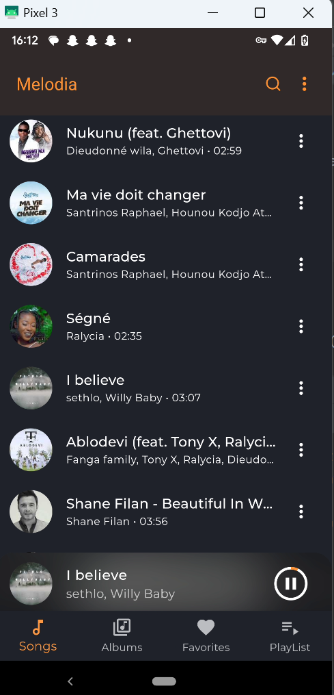
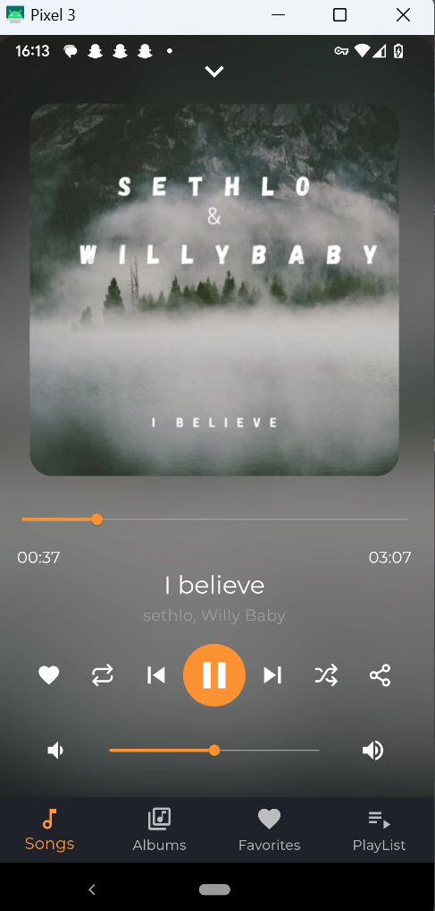
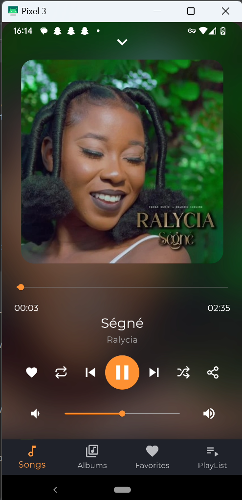
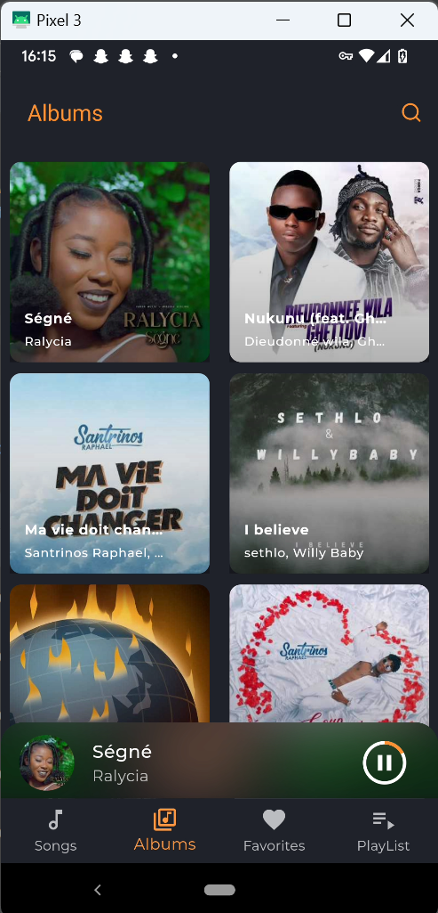
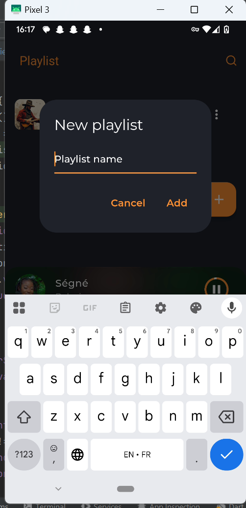
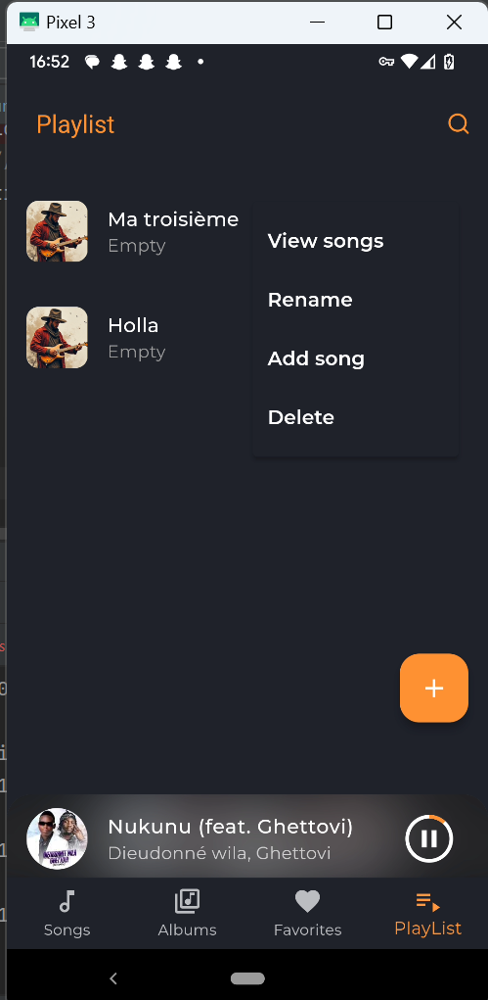

# 🎵 LaMelodia

LaMelodia is a modern local music player built with **Flutter**. It features a sleek, dark-themed interface and smooth animations for a polished user experience. Designed for simplicity and usability, it allows users to easily browse, play, and manage their local music library.

---

## ✨ Features

-  Browse and play local audio files
-  Modern dark theme UI
-  View songs by artist, album, or playlist
-  Play, pause, skip, and repeat functionality
-  Mini-player with expandable full player view
-  Responsive layout with smooth transitions
-  Permissions handling for accessing local storage

---

## 🖼 Screenshots

<div align="center">
  <table>
    <tr>
      <td></td>
      <td></td>
      <td></td>
    </tr>
    <tr>
      <td align="center">Home Screen</td>
      <td align="center">Player View</td>
      <td align="center">Player View</td>
    </tr>
    <tr>
      <td></td>
      <td></td>
      <td></td>
    </tr>
    <tr>
      <td align="center">Albums</td>
      <td align="center">playlist</td>
      <td align="center">playlist</td>
    </tr>
  </table>
</div>

---

## 🚧 Upcoming Features

- **Search** for songs, artists, or playlists
- **Add a song** to a playlist
- **Create and manage** custom playlists
- **Persistent player** on lock screen or background
- **Notification controls** for quick access playback
- Shuffle and repeat modes with smarter handling
-  Theme customization and improved accessibility
-  **Equalizer**
-  **Settings**

---

##  Getting Started

### Prerequisites

- Flutter SDK (latest stable)
- Dart
- Android Studio or VS Code

### Run Locally

```bash
git clone https://github.com/yourusername/lamelodia.git
cd lamelodia
flutter pub get
flutter run

## Project Structure

lib/
├── app/
│   ├── modules/          # Feature modules (home, player, playlist)
│   ├── routes/           # App navigation (using GetX)
│   └── theme/            # App theming and constants
├── controllers/          # Business logic controllers
├── models/               # Data models
├── services/             # Audio service and permissions
├── widgets/              # Reusable UI components
assets/
├── fonts/                # Custom fonts
├── icons/                # App icons
├── images/               # Static images
screenshts/               # App screenshots
test/                     # Unit tests

## 🤝 Contributing
Fork the project

Create your feature branch (git checkout -b feature/AmazingFeature)

Commit your changes (git commit -m 'Add some AmazingFeature')

Push to the branch (git push origin feature/AmazingFeature)

Open a Pull Request


